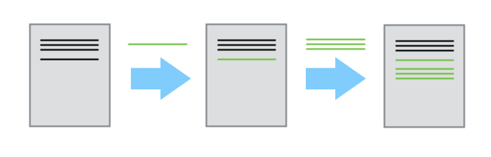
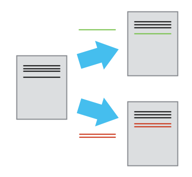
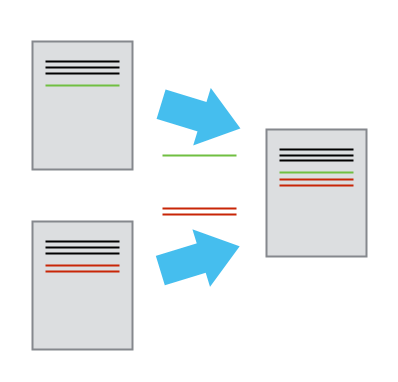

# Version Control

What is Version Control and why do I need it?

## The problem

Unfortunately the situation below is more common than we like to admit.

[](http://www.phdcomics.com)

\- "Piled Higher and Deeper" by Jorge Cham, <http://www.phdcomics.com>

It seems ridiculous to have multiple nearly-identical versions of the same
document. Some word processors let us deal with this a little better, such as:

- Microsoft Word's [Track Changes](https://support.office.com/en-us/article/Track-changes-in-Word-197ba630-0f5f-4a8e-9a77-3712475e806a)
- Google Docs' [version history](https://support.google.com/docs/answer/190843?hl=en)
- LibreOffice's [Recording and Displaying Changes](https://help.libreoffice.org/Common/Recording_and_Displaying_Changes).

## The solution

**Version control** systems start with a base version of the document and
then save just the changes you made at each step of the way.

A version control system is a tool that keeps track of changes for us and
helps us version and merge our files. It allows you to decide which changes make
up the next version, called a [`commit`], and keeps useful metadata about them.
The complete history of commits for a particular project and their metadata make
up a `repository`. Repositories can be kept in sync across different computers
facilitating collaboration among different people.

- Better kind of backup.
- Version control is like an unlimited *undo*.
- Review history.
- Restore older file versions.
- Ability to undo mistakes.
- Maintain several versions of the code at a time.
- Version control also allows many people to work in parallel.

### Changes are saved sequentially

You can think of it as a tape: if you rewind the tape and start at the base
document, then you can play back each change and end up with your
latest version.



### Different Versions Can be Saved

Once you think of changes as separate from the document itself, you
can then think about "playing back" different sets of changes onto the
base document and getting different versions of the document. For
example, two users can make independent sets of changes based on the
same document.



### Multiple Versions Can be Merged

Unless there are `conflicts`, you can even play two sets of changes onto the same
base document.



## Version control systems

There are many different version control systems:

- Git  `<<< We will use this VC system`
- Mercurial (`hg`)
- CVS
- Subversion (`svn`)
- ...

```{important}
Git != GitHub

- Git: version control system tool to manage source code history.
- GitHub: hosting service for Git repositories.
```

## Learn More

If you want to see a complete material to dive in Version Control using Git, please:

- visit our [SWD2: Version Control with Git and Github Course Material](https://arctraining.github.io/swd2_git/).
- book a place in one of our Git/Github courses: [Book Here](https://uolr3.leeds.ac.uk/temcatsearch(bD1lbiZjPTUwMA==)/courses.htm?sap-params=Z2Rfa2V5d29yZHM9VmVyc2lvbiUyMENvbnRyb2wmZ2Rfc3R5cGU9JmdkX3R1dG9yPUxhc3QlMjBuYW1lJmRhdGUxPWRkJTJmbW0lMmZ5eXl5JmRhdGUyPWRkJTJmbW0lMmZ5eXl5JmRhdGUxPTAwLjAwLjAwMDAmZGF0ZTI9MDAuMDAuMDAwMCZwcm92aWRlcmxpc3Q9NTAwMjI0MjkmYW5kb3I9T1Imc29ydD1CRUdEQSZnZF9jYWxsaWQ9SU5JVElBTCZzdHlsZT0%3d)