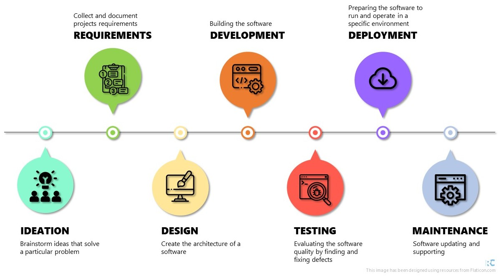

# Software Development Life Cycle

Most coding trainings/lessons just focus on developing coding writing skills.
However, this is just a step in the software development process.

**Software Development Life Cycle (SDLC)** is a cycle composed of seven steps:

* Ideation
* Requirements
* Design
* Development
* Testing
* Deployment
* Maintenance



## Ideation

First it is necessary to define a problem to solve: *What are we going to do?*

Two techniques are useful in the Ideation step:

* Brainstorming
* Research

```{admonition} Brainstorming
Brainstorming helps to explore your project concepts, generate new ideas, and 
rejecting bad ones.
```

```{admonition} Research
To create relevant work it is necessary to know the context in which it will
exist. Research helps to validate ideas from brainstorming sessions
```

## Requirements

Define a project plan: *How are we going to do it?*

In this step it is necessary to gather software requirements from **everyone**
involved in the project.

```{warning}
Each person involved in the project may have a different need, so it is
necessary to check with each one what they need. 

For example, in an academic environment, the PI usually has a more global view
of the project, while other participants have a more specific view.
```

Some topics to help define requirements include:

* final goal
* project scope (how to reach the final goal)
* what is feasible (and how)
* what is priority
* what resources are available
* deadlines
* potential risks

### Software Requirement Specification

All information regarding the requirements must be organized in a file, the
*Software Requirement Specification*.

**Everyone** involved in the project should review this document.
If any requirement has a problem (is incomplete, unclear, ambiguous, etc.), it
must be identified and corrected.

```{tip}
Depending on the characteristics of the project, it may be useful to generate
some additional documents to help understand the requirements.

For example, if the project is related to data collection, a Data Flow Diagram
can be help to track all variables, their connections and clarify requirements.
```

## Design

Translate the Software Requirement Specification into Design: *What is the
software architecture?*

When designing software, the *object-oriented* approach is a common programming paradigm.

```{admonition} Object-oriented components
* **Classes**: A user-defined type
* **Object instances**:  A particular object instantiated from a class.
* **Methods**: A function which is “built in” to a class
* **Constructor**: A special method called when instantiating a new object
```

The design usually includes descriptions of the architecture overview (high-
level design) and the design of its components (low-level design).

```{tip}
When design an object-oriented software you must follow some principles, like:

* Abstraction
* Encapsulation
* Decomposition
* Generalisation
```

The design can be described using a class diagram in the Unified Modelling
Language (UML). See below an UML class diagram for a purchasing system software:


```{seealso}
This UML example and a complete UML class diagram tutorial is provided by Visual
Paradigm [here](https://www.visual-paradigm.com/guide/uml-unified-modeling-language/uml-class-diagram-tutorial/).
<!-- is there any better reference for UML? -->
```

## Development

Translate the design document into a software. *Is this where the fun begins?*

```{admonition} Take your time!
:class: tip
Development is usually the most time consuming step in a Software Development
Life Cycle.
```

The development can be done using different methodologies:

* Waterfall: linear approach.
  * Each step must be completed before start a new one.
  * Changes in the original plan requires a restart in the development step.
* Agile: incremental approach.
  * Development divided in iterations (ongoing design).
  * May include development in parallel.
  * Continuous delivery.

```{note}
In the Agile methodology the Software Development Life Cycle steps presented 
here are not linear.
```

## Testing

Ensure that the software meets the requirements. *Is this software good?*

In this step, errors and failures are identified by exposing the code to an
environment similar to the end-user experience.

There are several types of testing, some examples include:

* **Unit testing**: are all components working?
* **Integration testing**: are all components working when fitted together?
* **Performance testing**: how does the software perform against different
workloads? It is fast? Stable?
* **Functional testing**: is the software aligned with Software
Requirement Specification?

```{note}
If any problems are identified, the code returns to the development stage.
Once fixed, the testing step must be performed again.
```

## Deployment

Make the software available. *Can other people use my code?*

```{tip}
You can use platforms like [GitHub](https://github.com/) to release your
software.
```

```{warning}
The functionality of the software is linked to several specifications related to
the operating system and versions of packages and other software related to the
project. Listing these specifications will help others to replicate the
environment in which the software was developed.
```

## Maintenance

*Is it over?*

The work doesn't end with the software deployment. In order for the software to
remain functional over time, it is necessary to provide some maintenance.

We can classify maintenance into a few categories:

* **Corrective**: fix reported errors/failures.
* **Preventive**: regular checks and fixes.
* **Perfective**: optimize implemented features, adding new features.
* **Adaptive**: keep the software updated according to changes external to the
project (new programming language version, new regulation, etc.).
