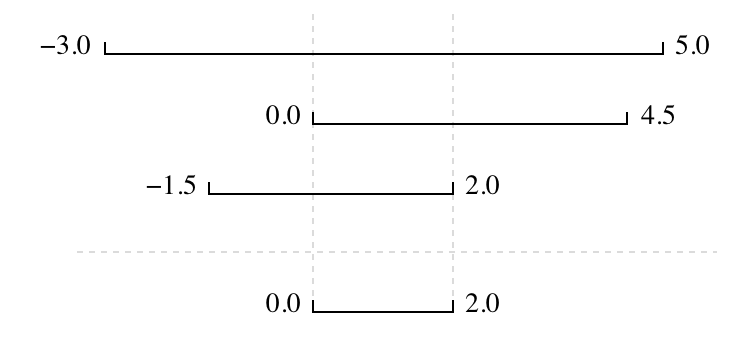

# Case of study

The last session of this training will consist of the execution of a project
with the objective of putting into practice the main points presented during the
training.

The aim is to practice:

- The steps of the Software Development Life Cycle, mainly the steps of:
  - Ideation
  - Requirements
  - Development
  - Testing
- Make use of good practices:
  - virtual environment (using `conda`)
  - project layout
  - code formatting (using `black`)
- Use version control collaboratively:
  - git
  - GitHub
    - branches
    - pull requests
    - issues
- Test-driven development

## The Problem

Participants must develop a code to find where two or more time series overlap.
The range of each time series is represented as a pair of numbers,
which are the time the interval started and ended.
The output is the largest range that they all include:

## Project Workflow

1. Brainstorm to define all necessary tasks
2. List all scenarios/tests
3. Setup the project structure
4. Setup the environment
5. Develop the test unit
6. Develop the main code
7. Develop some documentation
8. Update the GitHub
9. EXTRA: Using GitHub actions to trigger pytest.

*Please note that these ideas are just a starting point - participants will be free to design their project, as long as they respect the main idea and requirements.*
